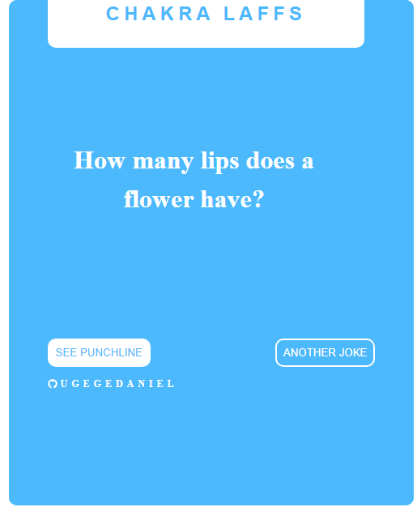

*deployed on vercel*
# Chakra-Laffs

This is a React / Typescript app that displays random jokes by categories. Its a simple app to demostrate the basic features of the react library and the react testing library in conjunction with jest. 

## Table of Contents

- [App Features](#app-features)
- [Concepts and Apis Employed](#concepts-and-apis-employed)
- [Built with](#built-with)
- [Live Preview](#live-preview)
- [Required Installations](#required-installations)
- [Installation of This App](#instalation)
- [License](#license)
- [Contact](#contact)
- [Acknowledgements](#acknowledgements)

<!-- Movie features -->

## App Features

- A user upon visiting the app, sees a random joke with two buttons; to reaveal the punchline or to see another joke.

<!-- concepts and apis employed -->

## Concepts and APIs Employed

- The API employed for movie information was gotten developed by TMDB [here](https://official-joke-api.appspot.com/random_joke).
- Official API documentation for the movie db can be found [here](https://official-joke-api.appspot.com/random_joke)
- This app demonstrates the use of basic concepts of React Library: 
  - Components structuring 
  - React Functional component with typescript
  - React hooks (useState, useEffect)
  - Custom hooks
  - Conditional rendering 
- This app also demonstrates the building of basic unit / integration tests with the React Testing Library.

<!-- BUILT wITH -->

## Built with

- HTML5
- Styled Components
- TypeScript
- React


<!-- LIVE PREVIEW -->

## Live Preview

Find the live version [here](https://chakra-laffs.vercel.app/).
Below is a screenshot of what it looks like.




<!-- REQUIRED INSTALLATION -->

## Required Installations

- Npm

<!-- INSTALLATION -->

## Installation of This Repository

Once you have installed the required packages shown on the [Required Installations](#required-installations), proceed with the following steps

Clone the Repository

```Shell
your@pc:~$ git clone git@github.com:ugegedaniel/chakra-laffs.git
```

Move to the downloaded folder

```Shell
your@pc:~$ cd chakra-laffs
```

Install all packages

```Shell
your@pc:~$ npm install
```

Open the app

```Shell
your@pc:~$ npm start
```

## License

Distributed under the MIT License. See `LICENSE` for more information.

<!-- CONTACT -->

## Contact

- 🇳🇬  Ugege Daniel - ugege62@gmail.com | [Github Account](https://github.com/ugegedaniel) | [Twitter](https://twitter.com/ugege_daniel) | [Linkedin](https://www.linkedin.com/in/daniel-ugege-50a499227) | 

## Acknowledgements

- <a href="https://official-joke-api.appspot.com/random_joke"> Random joke</a> <a href="https://github.com/frankly034"> Lewis Ugege</a> and God Almighty .